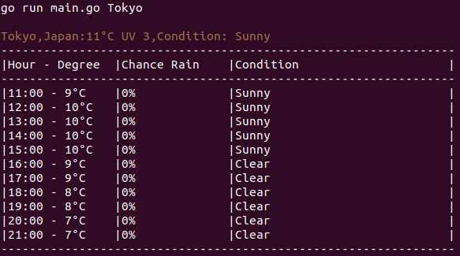

# Weather CLI App

## Overview

The Weather CLI App is a command-line interface (CLI) application built with Go. It fetches weather data from a specified API and displays it in the terminal. As of Version 1, the app is designed to show weather information for a specific city.

## Installation

1. Clone this repository:
    ```bash
    git clone git@github.com:mananispiwpiw/go-cli-weather-app.git
    ```
2. Install the required Golang package dependency (fatih/color):
    ```
    go get -u github.com/fatih/color
    ```
3. Set up environment variables based on your own weather API. Save your own json key into your env. The api key is located at your own account of Weather API.
   

## Usage

Run the application using the following command:

```
go run main.go
```

Make sure to follow the installation steps before running the application.

## Example

### Version 1

When we simply run "go run main.go", the result is as below :


### Version 1.1

-   Add Logic For Argument, so we can put the city we desired
-   Fixing some style



## Dependencies

-   fatih/color - Package for adding color to your terminal text.
-   Standard Golang packages
